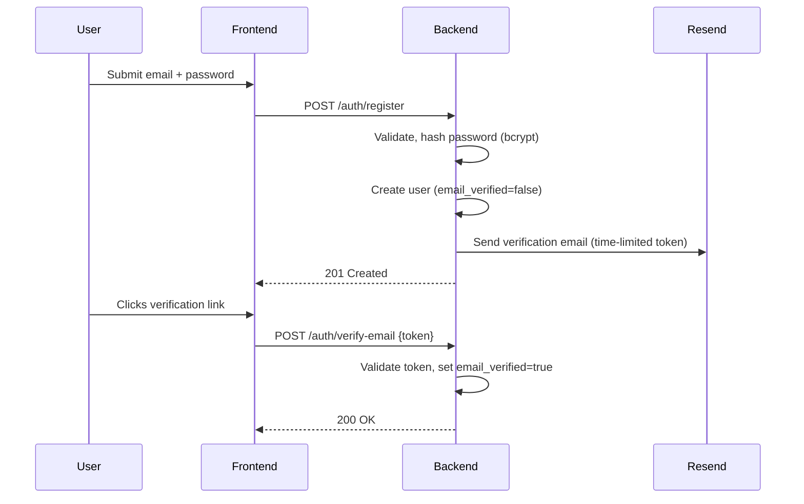
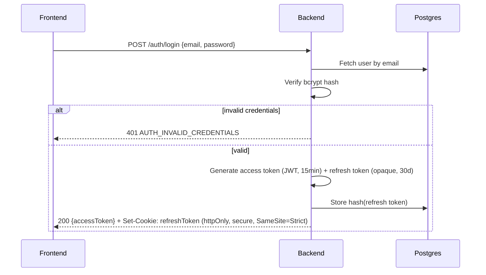
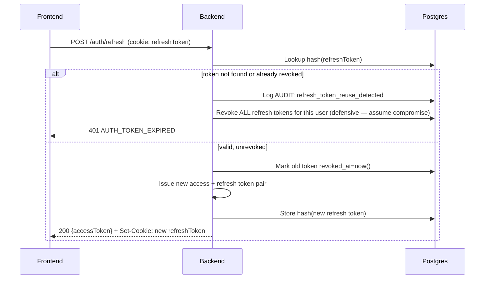

# DevTrack AI — Security

**Status:** Draft v1.0
**Depends on:** `05_Database_Architecture.md`, `06_API_Specification.md`, `07_Backend_Architecture.md`
**Closes:** review findings 3.1–3.7, PRD §14 AI-related risks, and every "belongs in
`12_Security.md`" deferral scattered across docs 04–09.

---

## 1. Threat Model (asset-based, not exhaustive STRIDE)

| Asset | Primary threat | Mitigated by |
|---|---|---|
| User passwords | Credential stuffing, DB breach | Bcrypt hashing, §3 |
| Refresh tokens | Theft → session hijack | Hashed at rest, rotation-on-use with reuse detection, §3 |
| GitHub OAuth tokens | Theft → third-party account access | Application-level encryption at rest, §4 |
| Resume/PII content | Exposure via public portfolio, or via AI provider | Allowlist DTOs (`04_System_Architecture.md` §6), §7 disclosure requirement |
| AI quota (shared, `09_AI_Architecture.md` §1) | Abuse by one user degrading service for all | Per-user daily cap, §6 |
| Public portfolio endpoint | The one unauthenticated surface — enumeration, scraping, SSRF via user-supplied links | §5, §8 |

## 2. Authentication Flows

### 2.1 Registration + Email Verification

Unverified users can log in (verification isn't a login gate, since blocking login
entirely on unverified email is a common source of support burden for very little
security benefit) but should see a persistent "verify your email" prompt — a product
decision, not a security one.

### 2.2 Login (password) & Token Issuance

**JWT signing: RS256, not HS256.** Asymmetric signing means the public key can be
distributed to anything that needs to *verify* tokens without ever holding the
ability to *issue* them — not a live need with a single backend service today, but
the cost of choosing this now is zero and it removes a real migration pain if the
architecture ever adds a second verifying service. Access token claims: `sub`
(userId), `roles`, `iat`, `exp` — no PII in the token payload (JWTs are
base64-encoded, not encrypted; anything in the payload is effectively public if the
token is ever logged or leaked).

### 2.3 Google OAuth2 Login

Standard authorization-code flow: `GET /auth/google` redirects to Google's consent
screen; `GET /auth/google/callback` exchanges the code server-side for Google's
tokens, resolves or creates the local user (`auth_provider=GOOGLE`), and issues
DevTrack's own access/refresh token pair identically to §2.2 — **downstream code
never branches on how a user authenticated**, per `03_Software_Requirements_Specification.md`
`FR-AUTH-02`'s original acceptance criterion.

### 2.4 Refresh Rotation & Reuse Detection

**The reuse-detection branch matters more than the happy path:** a revoked token
being presented again means either a client bug (retrying a stale token) or a stolen
token being used after the legitimate client already rotated past it. Since those
can't be distinguished server-side, the safe default is revoking the entire session
family — logging the user out everywhere — rather than guessing. This is a real
security control from `05_Database_Architecture.md` §7's schema, fully specified here.

### 2.5 Password Reset

Same shape as email verification (§2.1): time-limited token (30 min,
`FR-AUTH-05`) emailed via Resend, consumed once. On successful reset, **all existing
refresh tokens for that user are revoked** — a password reset is a reasonable signal
that any existing session should not be implicitly trusted to continue.

## 3. Token & Session Security Summary

| Control | Value/mechanism |
|---|---|
| Access token lifetime | 15 minutes |
| Refresh token lifetime | 30 days, rotated on every use |
| Refresh token storage | Hashed (never raw) in Postgres, per `05_Database_Architecture.md` §7 |
| Refresh token transport | httpOnly, secure, SameSite=Strict cookie — never readable by JS |
| Password hashing | bcrypt, cost factor 12 |
| JWT signing | RS256 |

## 4. Encryption at Rest for Third-Party Tokens

**Decision: GitHub OAuth tokens are encrypted at the application layer (AES-256-GCM)
before storage, not relied on solely via Neon's disk-level encryption.**

*Why defense-in-depth here specifically:* Neon encrypts data at rest by default, but
that protects against physical disk theft, not against a SQL injection or a
misconfigured read-replica exposing a `SELECT * FROM github_connection` result. A
GitHub token is a live credential to a third-party service — encrypting it at the
application layer means even a full read of that table doesn't yield usable tokens
without the encryption key, which lives in environment configuration (§9), not the
database. The encryption key itself needs its own rotation plan — noted as a
concrete Phase 2 implementation task (this is when `github_connection` first exists),
not designed further in this document.

## 5. File Upload Security

Applies to avatar uploads (`FR-PROF-01`) and certificate attachments (`FR-CERT-01`):

- **Validate actual file content (magic bytes), not just the file extension or
  client-reported MIME type** — a `.jpg` extension proves nothing about what's
  actually in the file; this is a real, common bypass if only the extension is
  checked.
- **Size limits enforced server-side** (not just a frontend `accept` attribute,
  which is trivially bypassed).
- **No virus/malware scanning pipeline for v1** — stated as a deliberate scope
  decision, not an oversight: a full scanning pipeline (e.g., ClamAV) is real
  infrastructure for a solo build, and Cloudinary (the storage destination) already
  applies its own content moderation/scanning on uploaded assets. Revisit only if
  this product ever accepts executable or document-macro-bearing file types, which it
  currently doesn't (images and PDFs only).

## 6. Rate Limiting — Consolidated

Two independent Bucket4j-backed limiters (mechanism established in
`07_Backend_Architecture.md` §6, extended by `09_AI_Architecture.md` §7):

| Limiter | Scope | Limit |
|---|---|---|
| Auth endpoints | `/auth/login`, `/auth/password-reset/request` | Strict, short window (per `NFR-SEC-02`) — brute-force/enumeration defense |
| AI endpoints | Per user, per day | 20 requests/day (`09_AI_Architecture.md` §7) |
| General API | All other authenticated endpoints | Generous, abuse-prevention baseline only |

## 7. AI Data Privacy Disclosure (resolves review finding 4.3)

Resume content and other user data are sent to Google's Gemini API for analysis
(`FR-ATS-01`, and the agents in `09_AI_Architecture.md` §3). **This needs an explicit
line in the product's privacy policy stating that resume/profile content is processed
by a third-party AI provider** — this is a product/legal requirement surfaced by a
security review, not something engineering can silently satisfy in code. Flagged here
so it lands on the privacy-policy checklist rather than being assumed handled. Before
sending user content, confirm Gemini API's current data-retention/training-use terms
for the API tier in use (these terms can change independently of this document and
should be checked at implementation time, not assumed from this doc's writing date).

## 8. SSRF Prevention (resolves the certificate-URL open question from `04_System_Architecture.md` §3.2's sibling finding)

**Final decision: the backend never server-side fetches a user-supplied URL** —
neither the certificate verification link (`FR-CERT-01`) nor any future
"unfurl a link preview" feature. Stored URLs are rendered as plain clickable links for
the human user to visit themselves. This isn't a temporary v1 simplification to
revisit — it's the simpler and safer permanent design; a link-preview feature, if ever
wanted, should go through a well-audited third-party unfurling service rather than the
backend fetching arbitrary user-supplied URLs directly, which is exactly the SSRF
pattern this decision avoids entirely rather than mitigates partially.

## 9. Secrets Management

Per `07_Backend_Architecture.md` §9: all secrets (DB credentials, Gemini/Resend/
Cloudinary API keys, JWT signing key, the token-encryption key from §4) are
environment variables injected by Railway/Vercel — never committed, never in
`application.yml`. **Added here:** the JWT signing keypair and the token-encryption
key should be generated once at initial deploy and treated as the two most sensitive
secrets in the system — a rotation plan for these (which invalidates all existing
sessions/encrypted tokens when rotated) is a deliberate, rare, manual operation, not
something automated for v1.

## 10. Audit Logging — Concrete Event List

Implements `NFR-SEC-05` against the `audit_log` table (`05_Database_Architecture.md` §7):

`login_success`, `login_failure`, `password_reset_requested`, `password_reset_completed`,
`refresh_token_reuse_detected` (§2.4), `github_connected`, `github_disconnected`,
`account_deletion_requested`, `email_changed`.

Each entry: `user_id`, `action`, `metadata` (jsonb — action-specific detail),
`ip_address`, `created_at`. Retained indefinitely for v1 (volume is low enough that a
retention/archival policy isn't a real concern yet) — revisit per §6 of the DB doc's
partitioning note if this table ever grows large.

## 11. CORS & Security Headers

- **CORS:** strict origin allowlist (the deployed Vercel frontend URL per
  environment) — closes review finding 3.5, implemented in
  `07_Backend_Architecture.md` §5.
- **CSRF:** the refresh-token cookie's `SameSite=Strict` attribute (§3) is the
  primary CSRF defense for `/auth/refresh` — a cross-site request cannot carry a
  `SameSite=Strict` cookie at all. All other state-changing endpoints authenticate via
  the `Authorization: Bearer` header (the access token), which a cross-site form/script
  cannot forge (it isn't a cookie, so the browser doesn't attach it automatically) —
  meaning most of this API is CSRF-immune by construction, not by an added CSRF-token
  mechanism layered on top. Worth stating explicitly since it explains why there's no
  separate CSRF token system in this design: the token transport decision from
  `06_API_Specification.md` §2.1 already solves it.
- **Response headers:** `Strict-Transport-Security`, `X-Content-Type-Options: nosniff`,
  `X-Frame-Options: DENY` (this app is never meant to be iframed), and a
  Content-Security-Policy scoped to the known set of external origins (Cloudinary,
  Gemini via backend-proxy only — so the frontend's CSP doesn't need to allowlist
  Gemini at all, since the frontend never talks to it directly, per
  `04_System_Architecture.md` §7).

## 12. Explicitly Deferred (stated, not silent)

- Session/device management (view/revoke individual sessions) — review finding 3.7,
  backlog, not v1.
- Automated dependency vulnerability scanning (Dependabot/`npm audit` in CI) —
  cheap enough to enable from day one in `14_DevOps.md`'s CI pipeline; noted here as a
  requirement that document should pick up, not re-decided in this one.

---

## Next Document

`13_Testing.md` — test strategy per layer (JUnit/Mockito backend, Vitest/RTL
frontend), and specifically what "critical-path coverage" (`NFR-*` requirement,
mentioned throughout but not yet enumerated) concretely means module by module.
